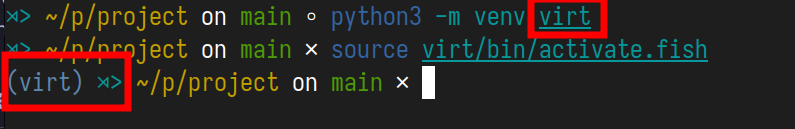
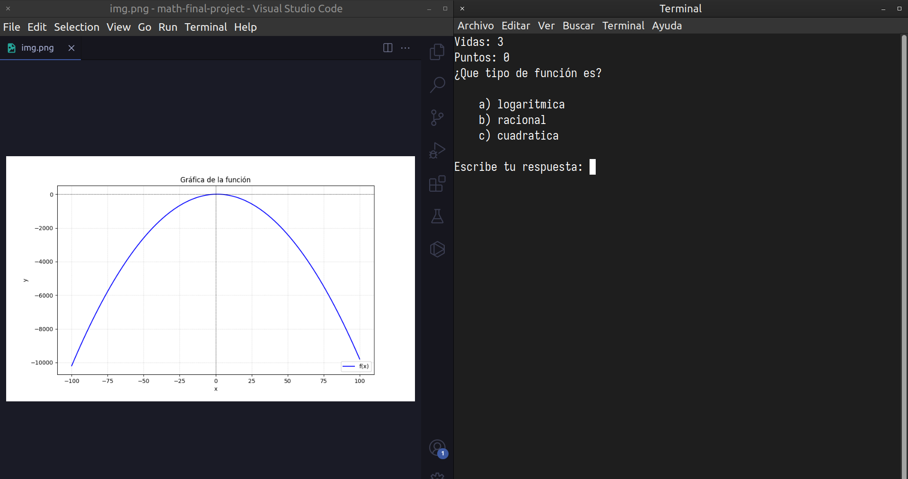

# MATH FINAL PROJECT

## Description

This project is for pass the final project and the topic is functions. That is the third topic in this discrete math module

## Usage and installation

```bash
git clone https://github.com/AND3SIL4/math_final_project.git ./final-project

cd final-project

python3 -m venv virt

source virt/bin/activate
```



```bash 

```


## Example

